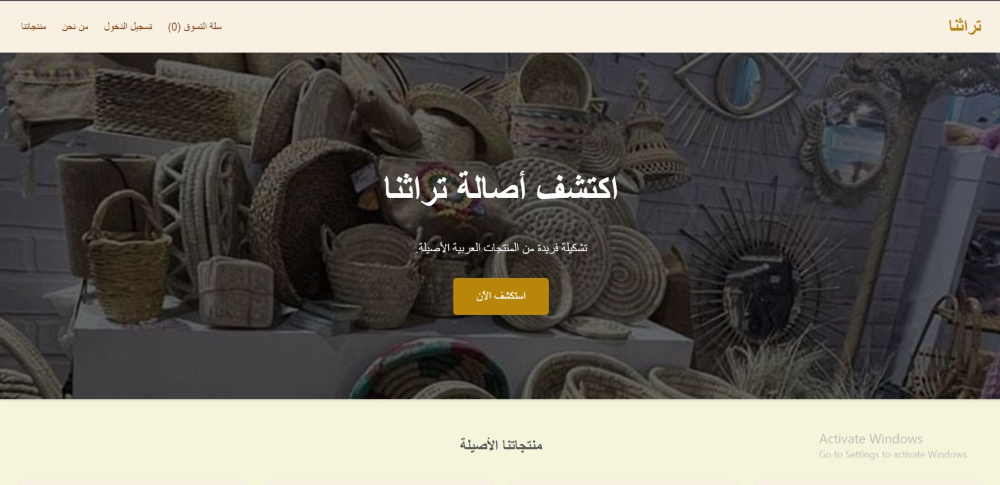

# Torathna-DEPI

  <h1 align="center" style="font-family: 'Segoe UI', Tahoma, Geneva, Verdana, sans-serif; font-weight: bold;">
    تراثنا | Torathna
  </h1>
  
<strong>Preserving Egyptian Heritage, Empowering Local Artisans.</strong>

---

   

 ## Table of Contents
- [Description](#description)
- [Architecture & Project Structure](#architecture--project-structure)
- [Key Features](#key-features)
- [Technologies Used](#technologies-used)
- [Database Schema](#database-schema)
- [Getting Started](#getting-started)
- [Credits](#credits)

---

## Description
**Torathna (تراثنا)** is an e-commerce and cultural preservation platform dedicated to celebrating Egyptian heritage. The platform connects authentic local artisans with a global audience, allowing traditional, handmade crafts (such as pottery, khayameya, handmade rugs, and copperware) to be shared, appreciated, and purchased worldwide. 

This project serves as our final graduation project, engineered using a scalable multi-layered .NET architecture.

---

## Architecture & Project Structure
The solution is structured using a traditional **N-Tier Architecture** to ensure clean separation of concerns, high maintainability, and testability:

* **`Turathna.sln`**: The main Visual Studio Solution file.
* **`BL` / `BLL` (Business Logic Layer)**: Contains the core business domain rules, services, validation logic, and DTOs (Data Transfer Objects).
* **`DAL` (Data Access Layer)**: Handles data persistence, repositories, and the Entity Framework Core Database Context.
* **`template` / `static`**: Contains UI components, Razor Views/Pages, layouts, and static web assets (CSS, JS, Images).

---

## Key Features
1. **Artisan Marketplace & Storefront**: Dedicated profiles for Egyptian artisans to showcase their history, craft story, and handmade items.
2. **Advanced Craft Filtering**: Easily browse historical items categorized by region of origin (e.g., Nubia, Khan el-Khalili, El-Fayoum) or materials used.
3. **E-Commerce Pipeline**: Secure shopping cart, order tracking, and checkout simulation tailored for global shipments.
4. **Cultural Heritage Blog/Wiki**: Educational section highlighting the history behind various traditional Egyptian crafts to increase cultural awareness.
5. **Responsive Dashboard**: Admin and Artisan panels to manage inventory, view sales metrics, and track user orders.

---

## Technologies Used
* **Backend Framework**: .NET 8.0 / ASP.NET Core (MVC or Web API)
* **Data Access**: Entity Framework Core (Code-First Approach)
* **Database**: Microsoft SQL Server / Azure SQL
* **Frontend**: HTML5, CSS3, JavaScript, Bootstrap / Tailwind CSS
* **Authentication**: ASP.NET Core Identity (JWT / Cookies tokens)

---

## Getting Started

### Prerequisites
* [.NET 8.0 SDK](https://dotnet.microsoft.com/download)
* [Visual Studio 2022](https://visualstudio.microsoft.com/) or VS Code
* SQL Server Express or LocalDB

---

## Team members

* Malak Mohamed Refaat
* Habiba Ali Zein
* Seif Waleed
* Yasmin Mohamed
* Islam Hany
* Fatma Nasser
  

